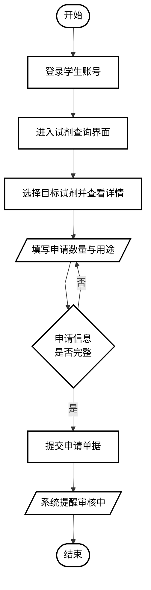
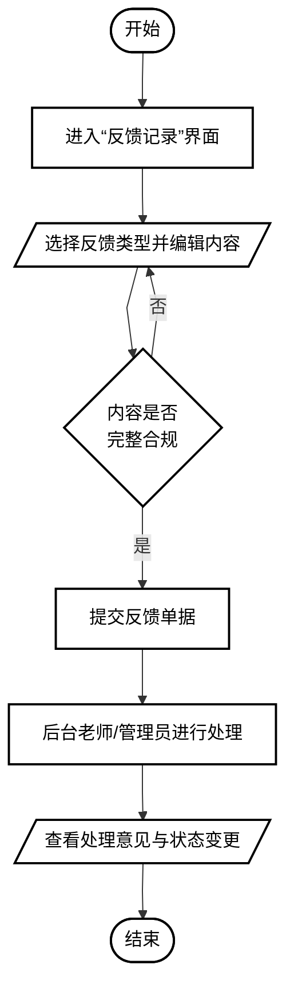
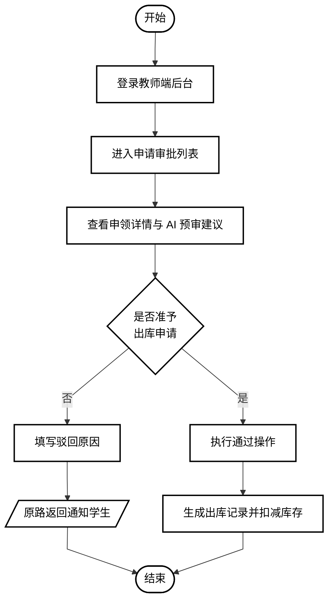
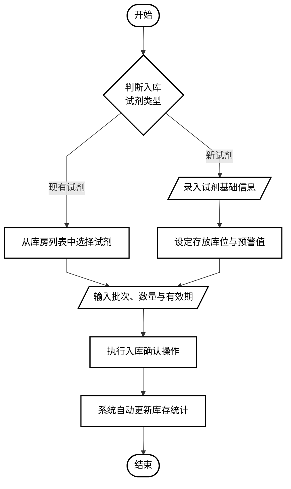
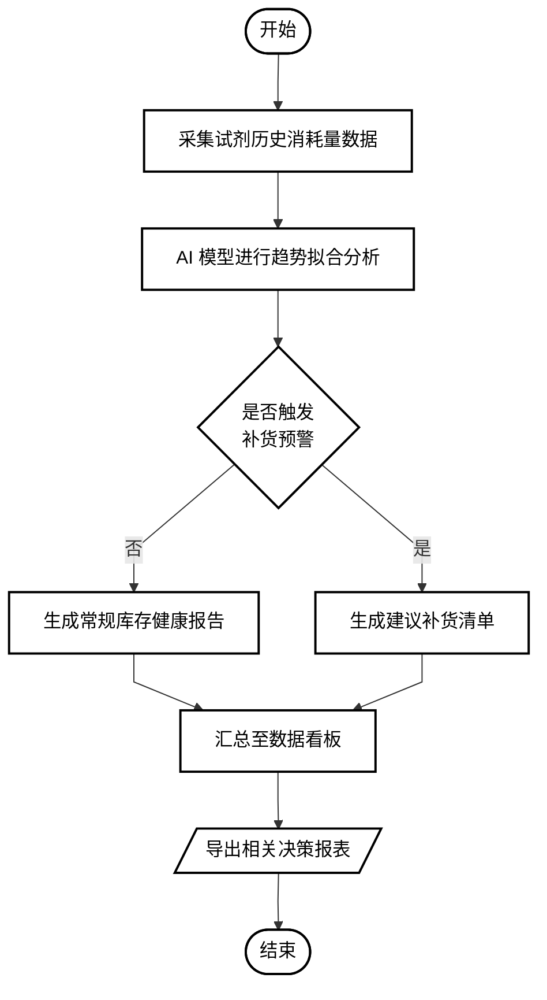
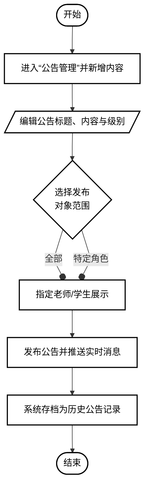

1学生：试剂领用申请流程

```mermaid
%%{init: {'flowchart': {'curve': 'linear'}}}%%
flowchart TD
    classDef bw fill:#fff,stroke:#000,stroke-width:2px,color:#000;

    Start([开始]) --> Login[登录学生账号]
    Login --> Search[进入试剂查询界面]
    Search --> Select[选择目标试剂并查看详情]
    Select --> Fill[/填写申请数量与用途/]
    
    Fill --> Check{申请信息<br/>是否完整}
    Check -- 否 --> Fill
    Check -- 是 --> Submit[提交申请单据]
    
    Submit --> Notice[/系统提醒审核中/]
    Notice --> End([结束])
    
    class Start,Login,Search,Select,Fill,Check,Submit,Notice,End bw;

```
学生端：反馈中心流程图

```mermaid
%%{init: {'flowchart': {'curve': 'linear'}}}%%
flowchart TD
    classDef bw fill:#fff,stroke:#000,stroke-width:2px,color:#000;

    Start([开始]) --> Entry[进入“反馈记录”界面]
    Entry --> Fill[/选择反馈类型并编辑内容/]
    
    Fill --> Check{内容是否<br/>完整合规}
    Check -- 否 --> Fill
    Check -- 是 --> Submit[提交反馈单据]
    
    Submit --> Wait[后台老师/管理员进行处理]
    Wait --> Result[/查看处理意见与状态变更/]
    Result --> End([结束])
    
    class Start,Entry,Fill,Check,Submit,Wait,Result,End bw;
```
老师功能模块设计申领审批处理流程图

```mermaid
    %%{init: {'flowchart': {'curve': 'linear'}}}%%
flowchart TD
    classDef bw fill:#fff,stroke:#000,stroke-width:2px,color:#000;

    Start([开始]) --> Login[登录教师端后台]
    Login --> List[进入申请审批列表]
    List --> Detail[查看申领详情与 AI 预审建议]
    
    Detail --> Judge{是否准予<br/>出库申请}
    
    Judge -- 否 --> Reject[填写驳回原因]
    Judge -- 是 --> Approve[执行通过操作]
    
    Reject --> Notify[/原路返回通知学生/]
    Approve --> StockOut[生成出库记录并扣减库存]
    
    Notify --> End
    StockOut --> End([结束])
    
    class Start,Login,List,Detail,Judge,Reject,Approve,Notify,StockOut,End bw;
```
教师端：试剂入库管理流程图

```mermaid
     %%{init: {'flowchart': {'curve': 'linear'}}}%%
flowchart TD
    classDef bw fill:#fff,stroke:#000,stroke-width:2px,color:#000;

    Start([开始]) --> Select{判断入库<br/>试剂类型}
    
    Select -- 新试剂 --> Register[/录入试剂基础信息/]
    Select -- 现有试剂 --> Search[从库房列表中选择试剂]
    
    Register --> Location[设定存放库位与预警值]
    Search --> Batch[/输入批次、数量与有效期/]
    Location --> Batch
    
    Batch --> Confirm[执行入库确认操作]
    Confirm --> Update[系统自动更新库存统计]
    Update --> End([结束])
    
    class Start,Select,Register,Search,Location,Batch,Confirm,Update,End bw;
```
管理员智能分析与预测流程图：

```mermaid
%%{init: {'flowchart': {'curve': 'linear'}}}%%
flowchart TD
    classDef bw fill:#fff,stroke:#000,stroke-width:2px,color:#000;

    Start([开始]) --> Collect[采集试剂历史消耗量数据]
    Collect --> AI[AI 模型进行趋势拟合分析]
    AI --> Logic{是否触发<br/>补货预警}
    
    Logic -- 否 --> Report[生成常规库存健康报告]
    Logic -- 是 --> Suggest[生成建议补货清单]
    
    Report --> Admin[汇总至数据看板]
    Suggest --> Admin
    
    Admin --> Export[/导出相关决策报表/]
    Export --> End([结束])
    
    class Start,Collect,AI,Logic,Report,Suggest,Admin,Export,End bw;
```
   管理员端：公告信息管理流程图

```mermaid
    %%{init: {'flowchart': {'curve': 'linear'}}}%%
flowchart TD
    classDef bw fill:#fff,stroke:#000,stroke-width:2px,color:#000;

    Start([开始]) --> Add[进入“公告管理”并新增内容]
    Add --> Edit[/编辑公告标题、内容与级别/]
    
    Edit --> Audience{选择发布<br/>对象范围}
    
    Audience -- 全部 --o Target[系统全员展示]
    Audience -- 特定角色 --o Target[指定老师/学生展示]
    
    Target --> Publish[发布公告并推送实时消息]
    Publish --> History[系统存档为历史公告记录]
    History --> End([结束])
    class Start,Add,Edit,Audience,Target,Publish,History,End bw;
```